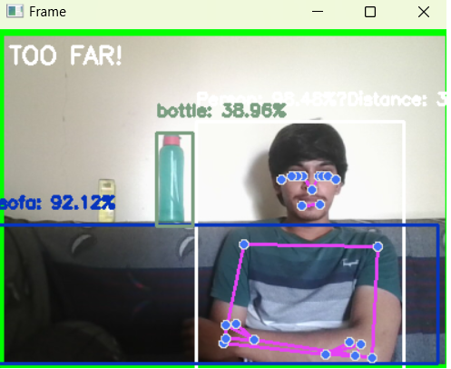

# 🤖 Real-Time Object Detection for Autonomous Cars 

## Overview 🚀🔍🤖
Revolutionizing autonomous driving with cutting-edge AI! This turbocharged project harnesses the power of MobileNet SSD to deliver lightning-fast object detection that keeps self-driving cars aware of their surroundings. Watch in amazement as it instantly identifies vehicles, pedestrians, traffic signs and more in real-time! 

But wait, there's more! We've supercharged this autonomous driving assistant with bonus features like human pose tracking and proximity alerts. Think of it as your car's very own AI co-pilot, keeping you safe and informed on the road ahead! 🚗💨
## Features ✨🛠️
- Real-time detection of multiple objects and people. 🕵️‍♂️📷
- Pose estimation for humans using MediaPipe. 🧍‍♂️💃
- Distance estimation from the camera and between individuals. 📏📐
- Alerts for incorrect posture or unsafe proximity. ⚠️🚨

## Prerequisites 📋💻
Before running the project, ensure that the following are installed:

1. 🐍 **Python 3.7+**

2. 📦 **Required Packages**: Install all the necessary Python packages using the following command:
   ```sh
   pip install numpy
   pip install opencv-python
   pip install opencv-contrib-python
   pip install opencv-python-headless
   pip install opencv-contrib-python-headless
   pip install matplotlib
   pip install imutils
   pip install mediapipe
   ```

## How to Run 🏃‍♂️💻

### Step 1: Clone or Download the Project 📁📥

Download or clone the project repository to your local machine:

```sh
git clone https://github.com/astromanu007/AI-Driven-Object-Detection-for-Autonomous-Cars-
```

Navigate to the project directory:

```sh
cd AI-Driven-Object-Detection-for-Autonomous-Cars-
```

### Step 2: Download Model Files 📂🔗

This project uses the MobileNet SSD model to perform object detection. You need the following files:

- `MobileNetSSD_deploy.prototxt.txt`
- `MobileNetSSD_deploy.caffemodel`

Make sure both of these files are in the same directory as the script.

### Step 3: Running the Script 🖥️🚀

To start the real-time object detection, run the following command:

```sh
python real_time_object_detection.py --prototxt MobileNetSSD_deploy.prototxt.txt --model MobileNetSSD_deploy.caffemodel
```

### Command-Line Arguments
- `--prototxt`: Path to the Caffe deploy prototxt file.
- `--model`: Path to the pre-trained Caffe model.
- `--confidence`: Minimum probability to filter weak detections. Default is `0.2`.

### Step 4: Using the Application 🎥🖱️
- **Webcam Access**: The script uses the default webcam. Allow access for live detection.
- **Key Interactions**:
  - Press `q` to quit the application.
- Alternatively, press `Ctrl + C` to terminate the script from the command line.

## Project Details 📊📈

## Technology Stack Used 💻🔧

- **MobileNet SSD** for object detection 🖼️📦
- **MediaPipe Pose** for human pose estimation 🧍‍♂️🤸‍♀️
- **OpenCV** for real-time computer vision tasks 📷🖥️
- **NumPy** for numerical computations 📊➗
- **Imutils** for image processing utility functions 🛠️🖼️

### Tech Stack Overview 🚀🛠️
- 
- 
- 
- 

The main functionalities of the script include:

- **Object Detection**: Uses MobileNet SSD to detect different objects and people in the frame.
- **Pose Estimation**: Uses MediaPipe Pose to identify human pose landmarks.
- **Distance Calculation**: Estimates the distance between detected persons and from the camera.
- **Posture Fault Detection**: Identifies potential posture faults such as uneven shoulders or hips.

## Troubleshooting 🛠️🔧

*Note: YOLO is not used in this project as it is already used in the previous project for autonomous cars which was in the same repository and is under development for further modifications.*
1. **Model Files Missing**: Ensure both the `prototxt` and `caffemodel` files are available in the same directory.
2. **Webcam Not Detected**: Verify that your webcam is connected and functioning correctly.
3. **Dependencies**: Ensure all required dependencies are installed using `pip`.

## Example Output 📸🖼️
Upon running the script, you will see a window displaying:

### Images 📷
- 
- 
- Bounding boxes around detected objects.
- Human pose landmarks.
- Alerts for unsafe distances or posture faults.

## Additional Notes 📝🔍
Further enhancements are on the way to improve the detection accuracy, and performance, and extend the system capabilities for broader applications, including real-time monitoring and safety solutions. 🚀🛠️

**Note**: A version of this project designed specifically for autonomous cars has been modified and is still in use for research and development purposes.
- **Performance**: Real-time processing may vary depending on the performance of your computer.
- **Focal Length Calibration**: You may need to adjust the focal length in the `estimate_distance()` function for more accurate distance estimations.

## License 📜
This project is licensed under the MIT License.

## Created by 👨‍💻
Created by Manish Dhatrak
- **LinkedIn**: [LinkedIn Profile](https://www.linkedin.com/in/manish-dhatrak-b759171aa/)

## Contact 📧💬
For any questions or issues, please feel free to reach out. 🤝

- **Email**: manishdhatrak1121@gmail.com
- **GitHub**: [GitHub Profile](https://github.com/astromanu007)
